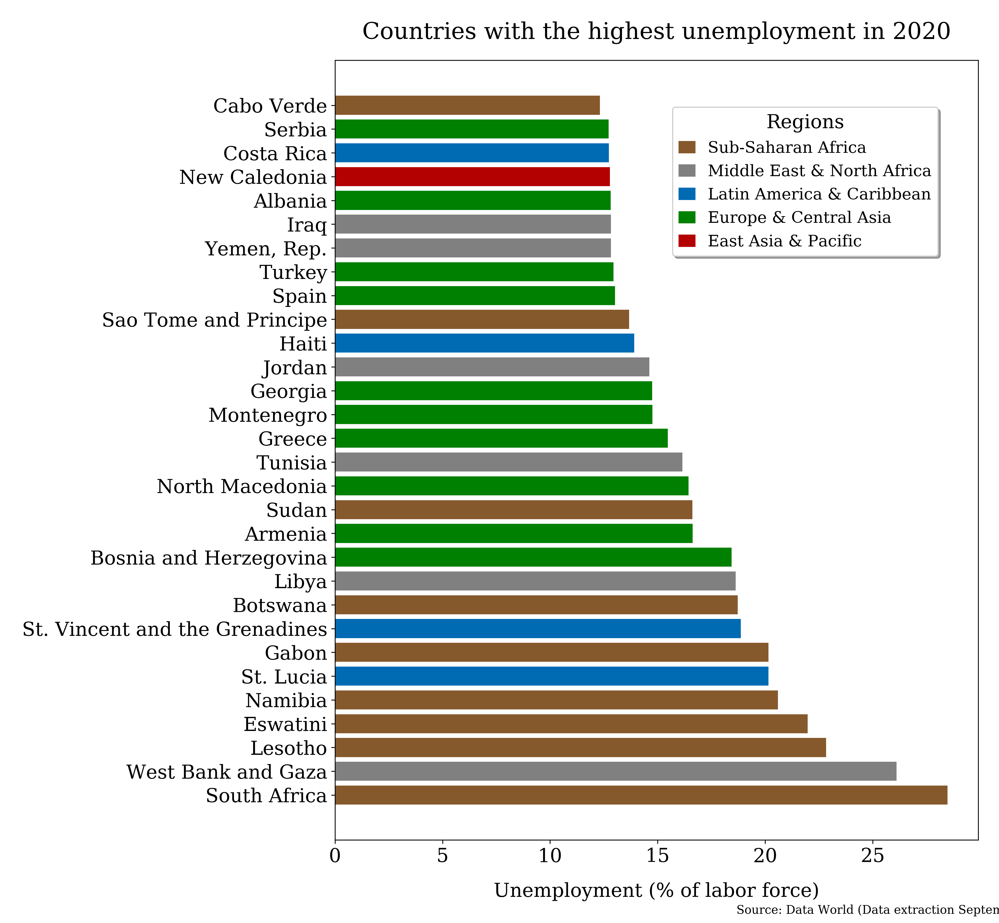
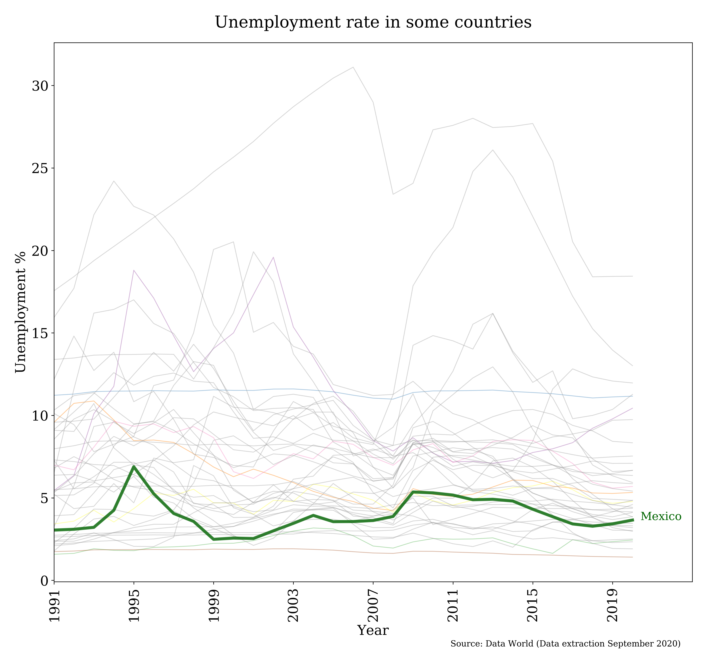

# Unemployment Rate In The World

Unemployment referes to the share of the labor force that is without work but available for and seeking employment. The data was downloaded from [World Data](https://data.worldbank.org/indicator/SL.UEM.TOTL.ZS) that represents the % total labor force in the world.

The file Unemployment_data.csv represent the raw data that was cleaned and used to make some visalizations.

We can see the 30 Countries with the highest unemployment rate in 2020.

The file SelectedCountries.csv has some countries codes that can be used to filter and plot them in a line chart or see the [line chart animated](https://public.flourish.studio/visualisation/4946339/) in flourish.

